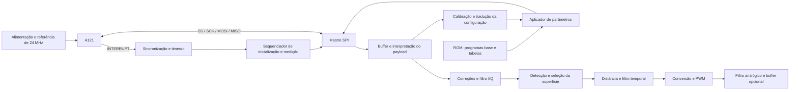

# Arquitetura proposta em SystemVerilog

**P — proposta de projeto.** Os blocos abaixo não foram implementados em RTL nesta entrega. Dependem das informações consolidadas em [PROTOCOLO.md](PROTOCOLO.md) e das pendências do [README](README.md).

## 1. Divisão em módulos



| Módulo proposto | Responsabilidade | Interface principal |
|---|---|---|
| `a121_power_ctrl` | ENABLE, temporizações e estado inicial dos sinais | `start`, `power_ready`, `enable`, `fault` |
| `spi_master_mode0` | Serializar palavras, amostrar MISO, temporizar SS | TX/RX valid-ready, contador de palavras, busy/done |
| `a121_transaction` | Montar cabeçalhos, descartar latência e separar payload | comando, endereço, tamanho, fluxo de dados |
| `a121_irq_ctrl` | Sincronizar IRQ, coordenar espera e timeout | IRQ sincronizada, estado de espera, timeout |
| `a121_program_rom` | Guardar imagens base e tabelas | endereço, dado, válido |
| `a121_patch_engine` | Alterar campos e instruções condicionais | imagem base, referências, valores calculados |
| `a121_calibration_ctrl` | Sequenciar subprogramas e resultados da calibração | transações, IRQ, amostras, resultados de calibração |
| `a121_calibration_math` | Cálculos usados pelas etapas de calibração | operandos/resultados em ponto fixo |
| `a121_config_translate` | Gerar parâmetros internos a partir da configuração | faixa/perfil/HWAAS/taxas + calibração |
| `a121_measure_ctrl` | Iniciar, esperar, validar evento, ler e reconhecer | estado do sensor, transações, buffers |
| `a121_payload_decode` | Identificar amostras, metadados e flags | payload → I/Q, temperatura, saturação, status |
| `iq_preprocess` | Correções necessárias e filtragem espacial | I/Q por ponto e subsweep |
| `surface_detector` | Limiar, candidatos, seleção do eco da superfície | pico, fração de posição, confiança |
| `distance_filter` | Conversão em distância, mediana/média | distância, válido, idade do resultado |
| `distance_to_pwm` | Escala, saturação, código de falha e PWM | distância + válido → pino PWM |

Essa separação é funcional. A síntese pode compartilhar multiplicadores, divisores e RAM. Não são necessários núcleos independentes de aritmética para cada cálculo se a taxa de atualização permitir executar operações sequencialmente.

## 2. Clock, reset e interfaces

### Clock de processamento

Usar inicialmente um único domínio de clock da FPGA com sinais de habilitação para o mestre SPI, sempre que a frequência escolhida permitir. Isso simplifica transferência de dados entre os blocos.

O clock da placa ainda não foi informado. Manter parâmetros `CLK_HZ`, `SCK_DIV`, tempos de startup, timeouts e frequência de atualização. O clock de 24 MHz do circuito do A121 é uma referência separada.

### IRQ

INTERRUPT é assíncrono em relação ao clock da FPGA. Usar sincronizador apropriado e esperar a condição de nível/handshake definida pelo protocolo. Não depender apenas de um detector de borda: se IRQ já estiver alto quando a FSM entrar no estado de espera, a borda pode ter ocorrido antes.

No startup, ignorar IRQ até o estado em que o programa torna a saída válida. Cada espera precisa de timeout. Em timeout, invalidar a saída e registrar o estado que falhou.

### MISO

MISO é temporizado em relação ao SCK produzido pelo mestre. Implementar sua captura com análise de timing dos pinos, atraso do sensor e roteamento da placa. Um sincronizador genérico de dois flip-flops colocado sem considerar as bordas pode deslocar os bits e não substitui o projeto da interface SPI.

### Contrato de dados

Um fluxo de I/Q pode transportar:

```text
sample_valid, sample_ready
i_signed[15:0], q_signed[15:0]
point_index, subsweep_index, sweep_index
frame_start, frame_end
```

Esses campos são uma proposta para a interface **interna** da FPGA; não descrevem diretamente a codificação no fio do A121.

A saída do detector deve ter pelo menos:

```text
distance_value, distance_valid
no_target, saturated, calibration_required
measurement_age, fault_code
```

Uma distância velha ou uma leitura saturada não deve ser apresentada como uma nova medição válida.

## 3. Como reduzir o primeiro protótipo

Proposta inicial, a confirmar depois de definir a faixa:

- um sensor;
- uma configuração fixa de perfil/faixa;
- um subsweep, se a faixa e o perfil permitirem;
- aquisição sob demanda;
- buffer simples;
- taxa baixa o suficiente para depuração;
- processamento de distância para um eco dominante, com rejeição de leituras inválidas.

Isso reduz opções do controlador, mas **não elimina automaticamente a calibração do sensor**. A necessidade de vários perfis/subsweeps ou cancelamento de vazamento em curta distância depende da faixa pretendida.

A configuração fixa pode permitir que a parte independente da calibração seja calculada antes da síntese e armazenada em ROM. Valores que variam com o sensor/temperatura continuam dinâmicos. Só fazer essa separação após mapear suas dependências em `acc_translation_a121_translate`.

## 4. Calibração e configuração: parte de maior risco técnico

Uma ROM contendo transações pode ajudar a sequenciar etapas, mas o sequenciador precisa suportar pelo menos:

- escrever e ler registradores;
- carregar trechos de programa;
- esperar IRQ e testar status;
- ler blocos de amostras;
- calcular/selecionar resultados;
- alterar parâmetros;
- ramificar em função de resultados/erros.

As listagens mostram cálculos como busca de máximos, fase via atan2, desembrulhamento de fase, somas, normalizações e compensações. Em hardware eles podem ser implementados com aritmética de ponto fixo, tabelas, CORDIC ou recursos compartilhados. A escolha depende da exatidão exigida por cada etapa.

Não é necessário duplicar todas as funcionalidades periféricas do STM32. É necessário preservar a **capacidade funcional de controle e cálculo** usada pelo sensor. Uma implementação puramente RTL pode acabar exigindo mais projeto do que a interface SPI sugere.

Para cada etapa, o modelo de referência precisa especificar:

1. estado inicial e programa/entrada;
2. registradores/patches de entrada;
3. condição de término e timeout;
4. layout da resposta;
5. aritmética, arredondamento e limites;
6. resultado usado pela próxima etapa;
7. critérios de falha e recuperação.

Os nomes dos nove estágios recuperados dão o roteiro, mas não substituem esses contratos.

## 5. Processamento para obter distância

### 5.1 Caminho mínimo a validar

1. Extrair I/Q e metadados de acordo com a configuração.
2. Aplicar as correções necessárias para reproduzir o serviço.
3. Filtrar ao longo dos pontos de distância.
4. Calcular amplitude ou potência.
5. Aplicar limiar e localizar picos.
6. Selecionar o candidato que corresponde à superfície.
7. Interpolar a posição.
8. Converter posição para distância e aplicar correção de offset.
9. Filtrar no tempo e gerar status.

O exemplo local [example_processing_peak_interpolation.c](../../Src/examples/processing/example_processing_peak_interpolation.c) mostra filtro aplicado a I/Q, cálculo de amplitude, maior pico fora das bordas, interpolação com três pontos e conversão para metros. É um exemplo didático; não contém toda a robustez do detector de tanque.

### 5.2 Amplitude e potência

Para uma amostra complexa:

`P[k] = I[k]^2 + Q[k]^2`

`A[k] = sqrt(P[k])`

Comparar potências preserva a ordem dos máximos e pode economizar a raiz quadrada. Porém, limiares, médias e interpolação feitos sobre potência não produzem necessariamente o mesmo resultado dos feitos sobre amplitude. Definir qual domínio será usado e validar o erro.

Com I e Q de 16 bits com sinal, cada quadrado precisa de produto adequado; a soma cabe em 32 bits **sem sinal**, incluindo o caso extremo 2^31. Um caminho com sinal precisa acomodar esse valor positivo. Somar S potências exige bits adicionais, aproximadamente `ceil(log2(S))`, e filtros podem exigir mais margem.

### 5.3 Posição e distância

O exemplo calcula:

`d = d_start + (k + delta) × d_step`.

`d_start` e `d_step` vêm de `acc_processing_points_to_meter`, aplicado ao início e ao passo configurados. A unidade nominal de ponto é aproximadamente 2,5 mm; não tratar essa aproximação como substituta da conversão exata nem como garantia de precisão.

Como proposta de interpolação parabólica de três amplitudes:

`delta = 0,5 × (A[k-1] - A[k+1]) / (A[k-1] - 2×A[k] + A[k+1])`.

Tratar denominador próximo de zero, ausência de pico local e bordas. Limitar/desconsiderar resultados fora da vizinhança válida. Essa fórmula é proposta de referência para o RTL; a implementação final deve ser comparada numericamente com a função usada no SDK.

Uma correção de offset medida/calculada pelo detector pode ser necessária além dessa conversão geométrica.

### 5.4 Limiar e escolha da superfície

A aplicação local usa o detector com CFAR nos presets. CFAR estima o ruído usando pontos vizinhos para adaptar o limiar. Implementá-lo exige definir janelas de referência, região de guarda e tratamento de bordas.

Não assumir que o maior eco é sempre o líquido. Parede, estrutura interna e fundo podem competir. Verificar candidatos por faixa permitida, intensidade/limiar, continuidade entre medidas e comportamento esperado do tanque.

As opções CLOSEST e STRONGEST nos presets locais são escolhas diferentes: o preset pequeno usa CLOSEST; médio/grande usam STRONGEST. A escolha final precisa de dados do seu tanque.

### 5.5 Filtragem temporal e nível

Mediana de poucas medidas ajuda a rejeitar valores isolados; a média posterior reduz variação, acrescentando atraso. O tamanho das janelas deve ser escolhido junto com a taxa de atualização e a velocidade de mudança do nível.

Se for necessário nível em vez de distância:

`h = H - d`, com referência H definida fisicamente.

Filtrar não transforma eco incorreto em eco correto. Leituras inválidas precisam de tratamento explícito antes de entrar no filtro.

## 6. PWM proporcional à distância

Definir `d_min`, `d_max`, faixa útil de duty cycle e comportamento sem alvo.

Uma opção para um único pino é:

- 10%: menor distância válida;
- 90%: maior distância válida;
- 0%: sem resultado válido/falha, conforme contrato com o circuito receptor.

Essa reserva evita que falha pareça uma distância válida. É uma proposta, não padrão do sensor.

Para contador de período P ciclos:

```text
x = clamp(d, d_min, d_max)
duty_count = round(P × [0,1 + 0,8 × (x - d_min)/(d_max - d_min)])
pwm = (counter < duty_count)
```

Usar aritmética inteira escalada; verificar `d_max > d_min` e dimensionar os produtos para não haver overflow. Atualizar `duty_count` somente na fronteira do período para evitar pulsos truncados.

Para P = 2^B:

`f_PWM = f_FPGA / 2^B`.

**Exemplo ilustrativo:** clock de 50 MHz e B = 12 produzem cerca de 12,207 kHz de PWM. Isso é um exemplo de projeto; não estabelece o clock mínimo exigido pelo A121.

A resolução numérica da saída não equivale à precisão do radar. Mais bits de PWM não corrigem ruído, erro de offset ou seleção errada de eco.

## 7. Conversão em tensão

### PWM filtrado

Um filtro passa-baixas seguido de buffer pode produzir aproximadamente:

`V_out ≈ duty × V_high`

para níveis baixos próximos de zero e carga compatível.

Dimensionar o filtro para reduzir a ondulação na frequência PWM sem tornar a resposta lenta demais. Para RC de primeira ordem:

`f_c = 1 / (2πRC)`.

A resposta a uma mudança não é instantânea; após cerca de 5RC chega a aproximadamente 99,3% do novo valor ideal. V_high, tolerância de componentes e impedância da carga afetam a exatidão. Um buffer ajuda a isolar a carga do filtro.

Com a proposta de 10–90%, a faixa analógica útil também será aproximadamente 10–90% de V_high. Se for exigida outra faixa, como 0–3,3 V ou 0–10 V, projetar a etapa de ganho/offset e alimentação correspondente.

### DAC externo

Outra possibilidade é manter a distância digital dentro da FPGA e enviar um código a um DAC. Isso acrescenta componente e interface, mas permite especificar tensão, referência e erro de conversão diretamente.

O A121 não fornece essa tensão de distância por seus pinos Analog0/Analog1; a saída proporcional pertence ao seu módulo.

## 8. Orçamento de memória e tempo

Mínimo conhecido das duas imagens base: 10840 bytes. Acrescentar:

- tabelas de referência e parâmetros;
- programa modificado ou área de patch por bloco;
- resultados da calibração;
- buffers de aquisição e histórico;
- coeficientes, LUTs e memória de trabalho do processamento.

Para N amostras I/Q públicas por frame:

`memória_IQ = 4 × N bytes`.

Se há S sweeps e vários subsweeps, N inclui todas as amostras desses conjuntos. O payload real pode conter campos extras.

Estimar a taxa:

`T_ciclo >= T_aquisição + T_SPI + T_processamento + T_controle`

quando as etapas são sequenciais. Pipeline pode sobrepor parte dos tempos; o handshake e a memória do sensor limitam a sobreposição possível.

A frequência máxima do SPI não determina sozinha a frequência mínima da FPGA. Dimensionar depois de escolher faixa, resolução espacial, HWAAS, taxa e algoritmo.

## 9. Validação em etapas

### Marco A — interface elétrica

- Medir alimentação, referência e ENABLE.
- Capturar SS/SCK/MOSI/MISO.
- Confirmar modo, ordem de bits e ID esperado em sucessivas partidas.
- Comparar SS observado com a documentação.
- Confirmar que a leitura não depende de uma inicialização prévia pelo STM32.

### Marco B — controle e calibração

- Capturar uma partida completa do SDK de referência.
- Registrar cada estado, entrada, resposta e resultado intermediário.
- Implementar modelo numérico de referência das etapas usadas.
- Comparar modelo, RTL e SDK com os mesmos dados.
- Testar timeout, ID incorreto, eventos inesperados e reinicialização.
- Repetir calibração em condições térmicas distintas, sem presumir constantes universais.

### Marco C — aquisição

- Usar uma configuração fixa bem identificada.
- Salvar payload bruto, metadados e I/Q processado do mesmo frame.
- Verificar tamanho, unidade dos offsets, sinais, endianness e continuidade entre blocos.
- Confirmar que reconhecer o evento não sobrescreve dados ainda em uso.

### Marco D — distância em líquidos

- Comparar com posições físicas conhecidas da superfície.
- Cobrir tanque vazio/cheio, bordas da faixa e ausência de alvo.
- Avaliar paredes/fundo, espuma/agitação e condições de instalação relevantes.
- Medir erro, repetibilidade, taxa de falsos resultados e atraso do filtro.
- Comparar com o detector do SDK para a mesma configuração.

### Marco E — saída

- Testar distâncias mínima/máxima, saturação da escala e inválidos.
- Conferir frequência e duty cycle com instrumento.
- Medir tensão/ondulação/tempo de resposta sob a carga real.
- Simular mudanças de resultado durante o período PWM e conferir atualização sem pulsos parciais.

A entrega atual passou apenas nas verificações estáticas de extração registradas em `generated/verification.json`. Nenhum desses marcos de bancada foi executado.

## 10. Informações ainda necessárias do projeto

Estas decisões não impediram o levantamento, mas são necessárias para dimensionar e fechar a implementação:

- distância mínima e máxima entre sensor e líquido;
- atualização desejada e atraso aceitável;
- erro/repetibilidade desejados;
- tipo de tanque, montagem e líquidos/condições de superfície;
- FPGA e clock disponíveis;
- alimentação e faixa de tensão da saída, carga e ondulação aceitável;
- se a saída representará distância ou nível.

Até essas definições, manter os blocos e cálculos parametrizáveis. O próximo passo técnico é fechar o modelo de inicialização/calibração de uma configuração única; implementar somente o mestre SPI e o PWM ainda não completa o controlador do A121.

